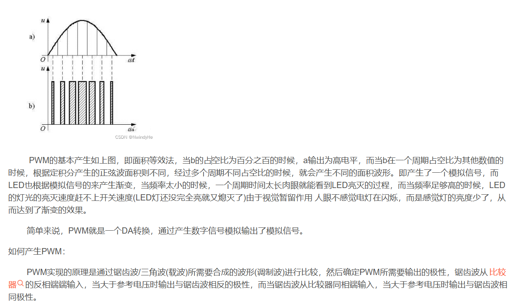

# 呼吸灯

## 呼吸灯原理

    

+ 解释uint8_t
|                       |         |                |
| --------------------- | ------- | -------------- |
| typedef unsigned char | uint8_t;|   无符号8位数   |
| typedef signed   char |int8_t;  |  有符号8位数    |
| typedef unsigned int  |uint16_t;|  无符号16位数   |
| typedef signed   int  | int16_t;|   有符号16位数  |
| typedef unsigned long |uint32_t;|  无符号32位数   |
| typedef signed   long | int32_t;|   有符号32位数  |
| typedef float         | float32;|  单精度浮点数   |
| typedef double        | float64;|   双精度浮点数  |

+ 解释ledSetup
    > 在Arduino和NodeMCU中，我们使用analogWrite()函数将0到254之间的值写入到LED引脚。但是ESP32开发板不支持analogWrite()函数。因此，我们将使用另一个函数，即ledcWrite()函数，而不是analogWrite()。 ledcWrite()与analogWrite() 非常相似。它还需要两个参数：我们想要写入PWM 值的PWM通道和我们想要写入所选通道的PWM值。 ESP32有16个PWM通道，您可以使用任何GPIO产生PWM输出。 ESP32提供了三个函数，用于为引脚分配PWM通道以及配置PWM 信号的分辨率、频率和占空比。这些函数分别是：
    >   ledcAttachPin(gpio, channel)
        ledcSetup(channel, frequency, resolution)
        ledcWrite(channel, dutycycle)
    1. double ledcSetup(uint8_t chan, double freq, uint8_t bit_num)
        其功能为设置 LEDC通道对应的频率和计数位数（占空比分辨率）
        其第一个参数chan表示通道号，取值为0 ~ 15即可设置16个通道，其中高速通道（0 ~ 7）由80MHz时钟驱动，低速通道（8 ~ 15）由 1MHz 时钟驱动；第二个参数freq为期望设置的频率；第三个参数为占空比分辨率的计数位数，其取值为0 ~ 20（该值决定后面 ledcWrite 方法中占空比可写值，比如该值写10，则占空比最大可写1023 即(1<<bit_num)-1。
    2. void ledcAttachPin(uint8_t pin, uint8_t channel);
        ledcAttachPin()函数原型如下所示，其功能为将指定的 LEDC 通道绑定到指定的 IO 口上以实现PWM的输出
        其第一个参数pin表示我们需要输出的IO口，第二个参数channel为我们指定的LEDC通道。
    3. void ledcWrite(uint8_t chan, uint32_t duty)
        ledcWrite()函数原型如下所示，其功能为指定的 LEDC 通道的输出占空比
        其第一个参数chan为我们指定的LEDC通道，第二个参数duty表示占空比，其取值范围与ledcSetup()函数的bit_num有关。
+ 解释PWM
  > PWM的基本原理：

        1. 什么是PWM：PWM简称脉冲宽度调制，即在一个周期内存在不同极性的电平状态。

        2. PWM频率：是指一秒钟内从高电平时间在到低电平时间，再从低电平跳到高电平的瞬间次数，也就是一秒钟内有多少个PWM的周期。f = T / 1(HZ)。

        3. PWM周期：是指一秒钟内从高电平时间在到低电平时间，T = f / 1(s)。

        4. PWM占空比：是指一个周期内高电平时间和总时间的比值。

        例如：PWM的周期为1ms，高电平时间为0.5ms，低电平时间为0.5ms，则频率就为1kHz，占空比就为百分之五十。
