# Spring学习笔记

[链接-MarkDown语法](https://simimi.cn/note/markdown-basic-syntax/#%E4%B8%80%E3%80%81%E5%9F%BA%E6%9C%AC%E7%AC%A6%E5%8F%B7%EF%BC%9A-gt)

## Spring框架概述

1. Spring是轻量级的开源的JavaEE框架
2. Spring可以解决企业应用开发的复杂性
3. Spring有两个核心部分：IOC和AOP
   (1) IOC:控制反转：把创建对象的过程交给Spring进行管理
   (2) AOP:面向切片，不修改源代码进行功能增强
4. Spring特点
   (1) 方便解耦，简化开发
   (2) AOP编程支持
   (3) 方便程序测试
   (4) 方便和其他框架进行整合
   (5) 方便进行事务操作
   (6) 降低API开发难度
5. 课程以Spring5.x为例

## 创建一个spring案例

1. 修改pom.xml文件
   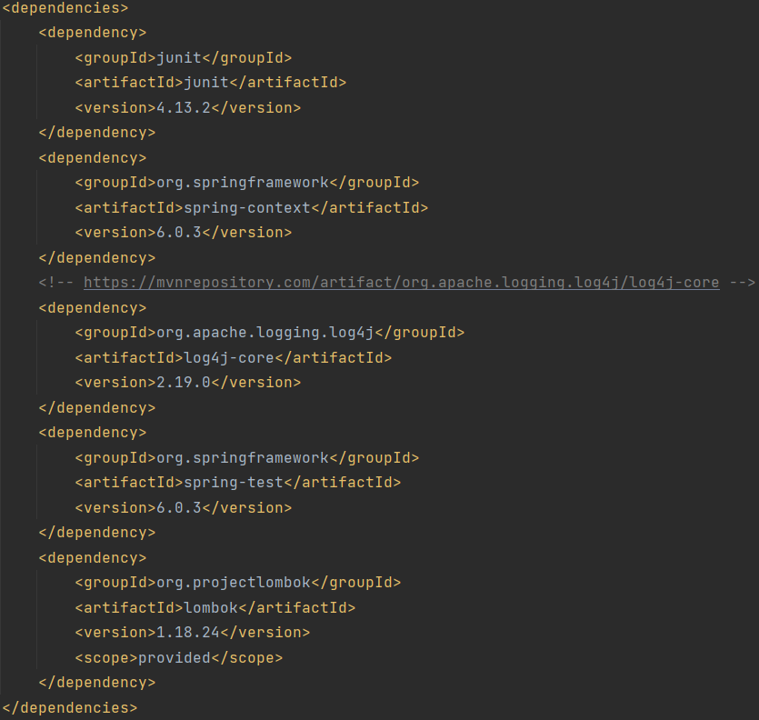
2. 编写main包里的代码
   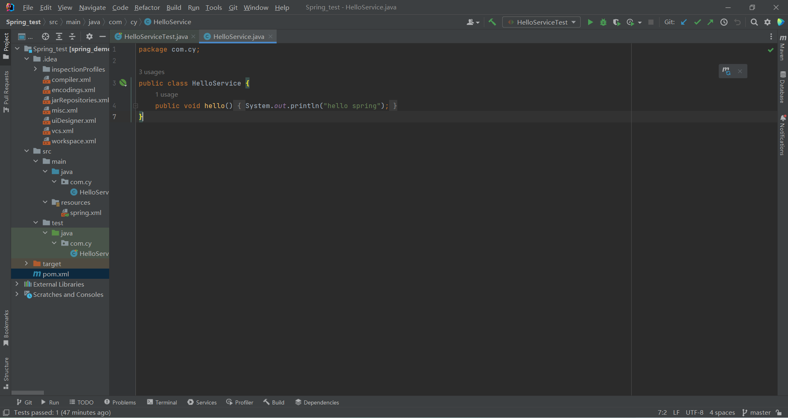
3. 在resource包里编写spring配置文件
   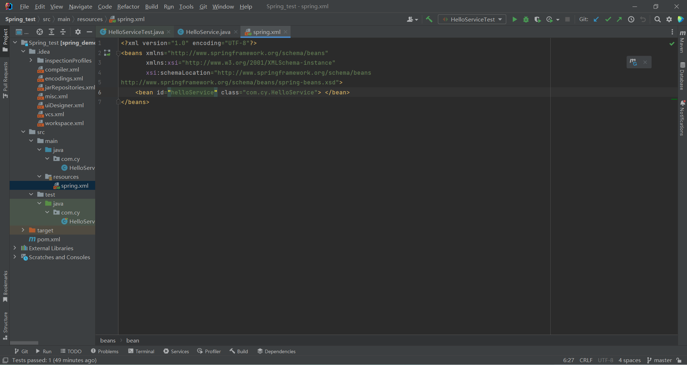
4. 在test包里编写测试代码
   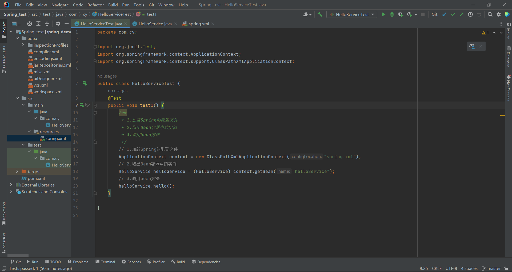
5. 运行测试代码
   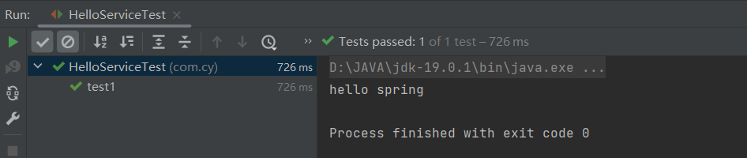

### 注意

+ MAVEN搭建Spring环境
  + 案例
   [链接](https://blog.csdn.net/qq_31993621/article/details/82470305)  
+ ERROR:JAVA: 错误: 不支持发行版本 5  
  + 解决方法
   [链接](https://eli-coin.blog.csdn.net/article/details/119142118?spm=1001.2014.3001.5506)

## IOC容器

1. IOC底层原理
2. IOC接口(BeanFactory)
3. IOC操作Bean管理(基于xml)
4. IOC操作Bean管理(基于注解)

### IOC概念和原理

+ 什么是IOC
   (1)控制反转，把对象创建和对象之间的调用过程，交给Spring进行管理
   (2)使用IOC目的：为了耦合度降低
   (3)做入门案例就是为了IOC实现

+ IOC底层原理
   (1)xml解析，工厂模式，反射

+ 画图讲解IOC底层原理
   目的：将耦合度降低到能够满足设计需求的最低限度
   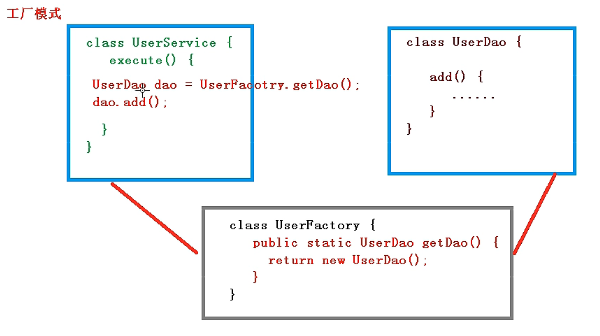
   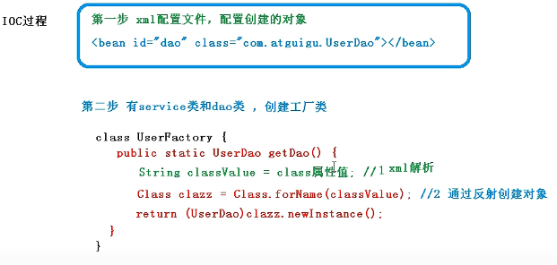

+ IOC接口
   1. IOC思想基于IOC容器完成，IOC容器底层就是对象工厂
   2. Spring提供IOC容器实现两种方式：（两个接口）
   (1)BeanFactory:IOC容器的基本实现，是Spring内部的使用接口，不提供开发人员进行使用。加载配置文件时候不会创建对象，在获取对象(使用)时才会创建对象(懒加载)
   (2)ApplicationContext：BeanFactory接口的子接口，提供了更多更强大的功能，一般面向开发人员使用。加载配置文件时候就会把在配置文件中的对象创建(预加载)
   3. ApplicationContext接口有实现类
   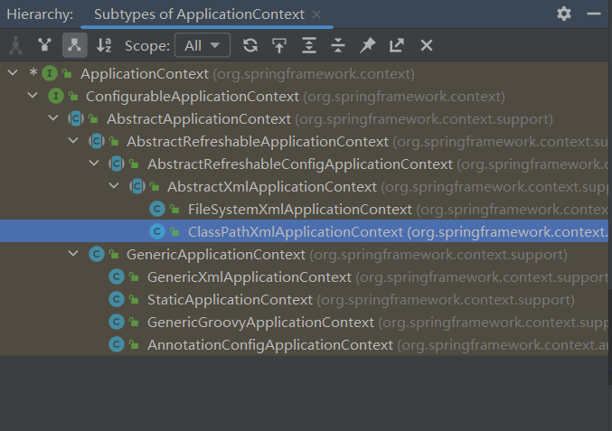

+ IOC操作Bean管理
   1. 什么是Bean管理
   (1)Spring创建对象
   (2)Spring注入属性
   2. Bean管理操作有两种方式
   (1)基于xml配置文件方式实现
   (2)基于注解方式实现

+ IOC操作Bean管理(基于xml方式)
   1. 基于xml方式创建对象
   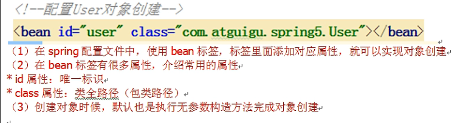
   2. 基于xml方式注入属性
   3. p名称空间注入
   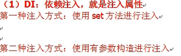
   第一种：
   (1)创建类，定义属性和对应的set方法
   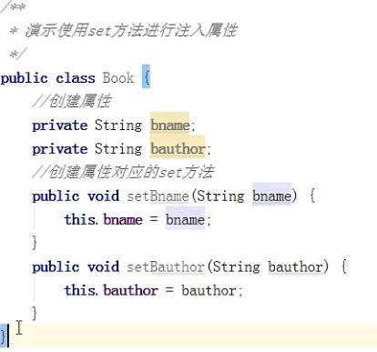
   (2)在spring配置文件配置对象创建
   效果类似于下图
   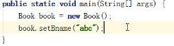
   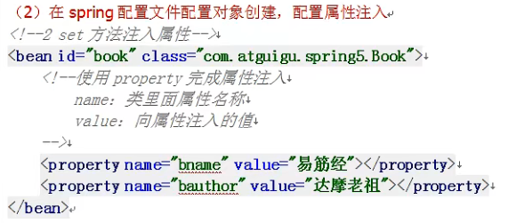
   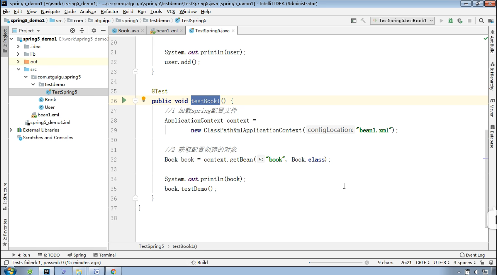
   第二种：使用有参数构造进行注入
   (1)创建类，定义属性，创建属性对应有参数构造方法
   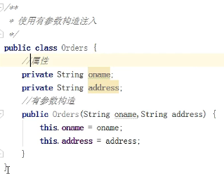
   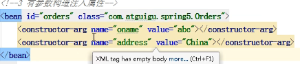
   第三种：基于p名称空间注入，可以简化基于xml配置方式
   （1）添加p名称空间在配置文件中
   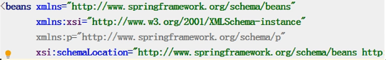
   (2)进行属性注入，在bean标签里面操作
   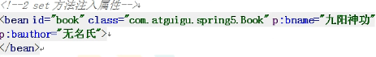

+ IOC操作Bean管理(xml注入其他类型属性)

   1. 字面量
   (1)null值
      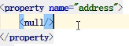
   (2)属性值中包含特殊符号，比如<>
      第一种：把<>进行转义
      第二种：把带特殊符号内容写到CDATA
      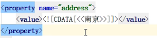
   2. 注入属性-外部bean
      (1)创建两个类service类和dao类
      (2)在service调用dao里面的方法
      (3)在spring配置文件中进行配置
      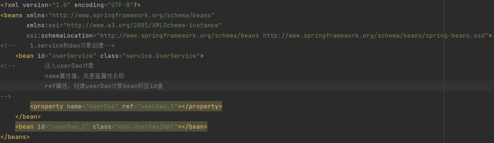
   3. 注入属性-内部bean
      (1)一对多关系：部门和员工
      一个部门有多个员工，一个员工属于一个部门
      部门是一，员工是多
      (2)在实体类之间表示一对多关系,员工的所属部门，使用对象类型属性进行表示
      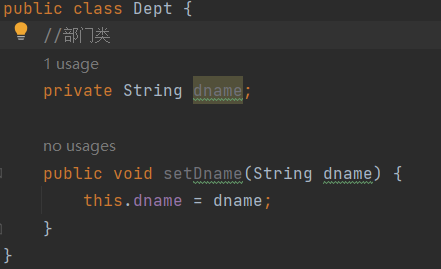
      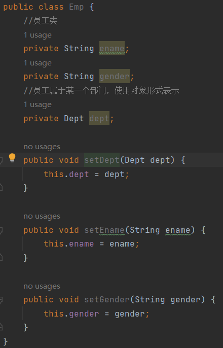
      (3)在spring配置文件中进行配置
      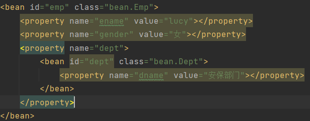
      注意：如果输出bean@地址，需要重写toString方法
   4. 注入属性-级联赋值
      在spring配置文件中进行配置

        ```123
        <!--     级联赋值-->
        <bean id="emp" class="bean.Emp">
        <!--        设置两个普通属性-->
                <property name="ename" value="David"></property>
                <property name="gender" value="男"></property>
        <!--    级联赋值-->
                <property name="dept" ref="dept"></property>
        <!--        <property name="dept.dname" value="技术部"></property>-->
            </bean>
            <bean id="dept" class="bean.Dept">
                <property name="dname" value="财务部"></property>
            </bean>
        ```

        作为对比，这是外部bean  

        ```123
            <!--    1.service和dao对象创建-->
                <bean id="userService" class="service.UserService">
            <!--        注入userDao对象
                        name属性值：类里面属性名称
                        ref属性：创建userDao对象bean标签id值
            -->
                    <property name="userDao" ref="userDao"></property>
                </bean>
                <bean id="userDao" class="dao.UserDaoImpl"></bean>
        ```

+ IOC操作Bean管理(xml注入集合属性)

   1. 注入数组类型属性
   2. 注入List集合类型属性
   3. 注入Map集合类型属性
      (1) 创建类，定义数组，list，map，set类型，生成对应set方法
      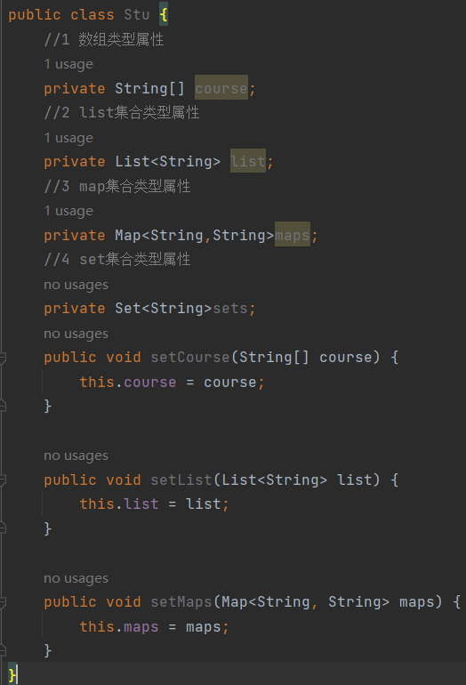
      (2) 在spring配置文件中进行配置
   4. 在集合类型里面设置对象类型值
   5. 把集合注入部分提取出来

        ```123
        public class Stu {
            //1 数组类型属性
            private String[] course;
            //2 list集合类型属性
            private List<String> list;
            //3 map集合类型属性
            private Map<String,String>maps;
            //4 set集合类型属性
            private Set<String>sets;

            //学生所学多门课程
            private List<Course>courseList;

            public void setCourseList(List<Course> courseList) {
                this.courseList = courseList;
            }

            public void setCourse(String[] course) {
                this.course = course;
            }

            public void setList(List<String> list) {
                this.list = list;
            }

            public void setMaps(Map<String, String> maps) {
                this.maps = maps;
            }

            public void setSets(Set<String> sets) {
            this.sets = sets;
            }

            public void test(){
                System.out.println(Arrays.toString(course));
                System.out.println(list);
                System.out.println(maps);
                System.out.println(sets);
                System.out.println(courseList);
            }
        }
        ```

        ```123
        <bean id="stu" class="com.example.Stu">
            <!--数组类型属性注入-->
                    <property name="course">
                        <array>
                            <value>Java课程</value>
                            <value>数据库课程</value>
                        </array>
                    </property>
            <!--list类型注入-->
                    <property name="list">
                        <list>
                            <value>张三</value>
                            <value>张饼子</value>
                        </list>
                    </property>
            <!--map类型注入-->
                    <property name="maps">
                        <map>
                            <entry key="JAVA" value="java"></entry>
                            <entry key="PHP" value="php"></entry>
                        </map>
                    </property>
            <!--set类型注入-->
                <property name="sets">
                    <set>
                        <value>MySQL</value>
                        <value>Redis</value>
                    </set>
                </property>
        ```

        ```4
        public class Course {
            private String cname;  //课程名称

            public void setCname(String cname) {
                this.cname = cname;
            }

            @Override
            public String toString() {
                return "Course{cname="+cname+"}";
            }
        }
        ```

        ```4
        <!--注入list集合类型，值是对象-->
                <property name="courseList">
                    <list>
                        <ref bean="course1"></ref>
                        <ref bean="course2"></ref>
                    </list>
                </property>
            </bean>
            <bean id="course1" class="com.example.Course">
                <property name="cname" value="Spring框架"></property>
            </bean>
            <bean id="course2" class="com.example.Course">
                <property name="cname" value="MyBatis框架"></property>
            </bean>
        ```

        ```5
        <!--1 提取list集合类型属性注入-->
            <util:list id="booklist">
                <value>猫和老鼠</value>
                <value>翡冷翠的一夜</value>
                <value>哈利波特</value>
            </util:list>

            <!--2 提取list集合类型属性注入使用-->
            <bean id="book" class="com.example.Book">
                <property name="list" ref="booklist"></property>
            </bean>
        ```

+ IOC操作Bean管理(FactoryBean)
   1. Spring有两2.种类型bean，一种是普通bean，另外一种工厂bean(FactoryBean)
   2. 普通bean:在配置文件中定义bean类型就是返回类型
   3. 工厂bean：在配置文件定义bean类型可以和返回类型不一样(可以修改默认返回的bean类型)
   第一步 创建类，让这个类作为工厂bean，实现接口FactoryBean
   第二步 实现接口里面的方法，在实现的方法中定义返回的bean类型
   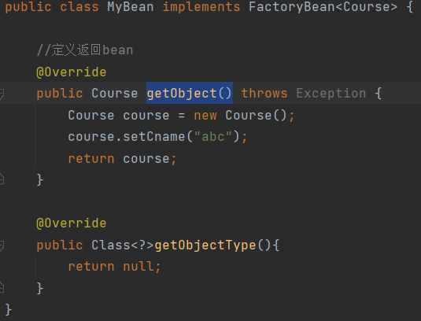
   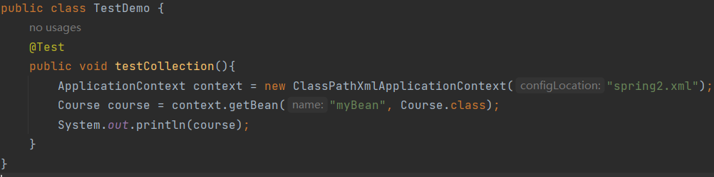
   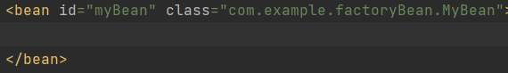

+ IOC操作Bean管理(bean作用域)
  1. 在Spring里边，设置创建bean实例是单实例还是多实例
  2. 在Spring里面，默认情况下，bean是单实例对象
   如图，地址相同
   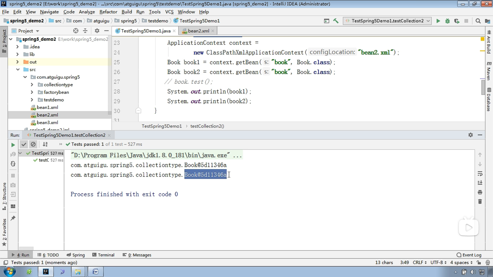
  3. 如何设置单实例还是多实例
   (1)在spring配置文件bean标签里面有属性用于设置单实例还是多实例
   (2)scope属性值
   第一个值：默认值，singleton，表示单实例对象
   第二个值：prototype，表示多实例对象
   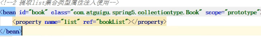
   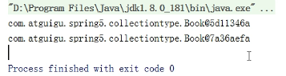
   (3)singleton和prototype区别
   第一：singleton单实例，prototype多实例
   第二：设置scope值是singleton时，加载spring配置文件就会创建单实例对象；设置scope值是prototype时候，不是在加载spring配置文件时候创建对象，在调用getBean方法时创建多实例对象。

+ IOC操作Bean管理(bean生命周期)
  1. 生命周期
   [链接-参考视频](https://simimi.cn/note/markdown-basic-syntax/#%E4%B8%80%E3%80%81%E5%9F%BA%E6%9C%AC%E7%AC%A6%E5%8F%B7%EF%BC%9A-gt)
   (1)从对象创建到对象销毁的过程
  2. bean生命周期
   (1)通过构造器创建bean实例(无参数构造)
   (2)为bean属性设置值和对其他bean的引用(调用set方法)
   (3)调用bean的初始化的方法(需要进行配置)
   (4)bean可以使用了(获取创建bean实例对象)
   (5)当容器关闭时候，调用bean的销毁方法(需要进行配置销毁的方法)
  3. bean的后置处理器，bean的生命周期完整为七步
   (1)通过构造器创建bean实例(无参数构造)
   (2)为bean属性设置值和对其他bean的引用(调用set方法)
   (3)把bean实例传递bean后置处理器的方法
   (4)调用bean的初始化的方法(需要进行配置)
   (5)把bean实例传递bean后置处理器的方法
   (6)bean可以使用了(获取创建bean实例对象)
   (7)当容器关闭时候，调用bean的销毁方法(需要进行配置销毁的方法)

+ IOC操作自动装配
    1. 什么是自动装配
        (1)根据指定装配规则(属性名称或者属性类型)，Spring自动将匹配的属性值进行注入
    2. 演示自动装配
        (1)根据属性名称自动注入
            实现自动装配
            bean标签属性autowire，配置自动装配
            autowire属性常用两个值：
            byName根据属性名称注入，注入值bean的id值和类属性名称一样
            byType根据属性类型注入
            `<bean id="emp" class="com.example.autowire.Emp" autowire="byName"></bean>`
            `<bean id="dept" class="com.example.autowire.Dept"></bean>`

+ IOC操作Bean管理(外部属性文件)
  1. 直接配置数据库信息
   (1)配置德鲁伊连接池

        ```添加依赖
        <dependency>
            <groupId>com.alibaba</groupId>
            <artifactId>druid</artifactId>
            <version>1.2.15</version>
        </dependency>
        <dependency>
            <groupId>org.aspectj</groupId>
            <artifactId>aspectjweaver</artifactId>
            <version>1.9.19</version>
        </dependency>
        ```

  2. 引入外部属性文件配置数据库连接池
   (1)创建外部属性文件，properties格式文件，写数据库信息
   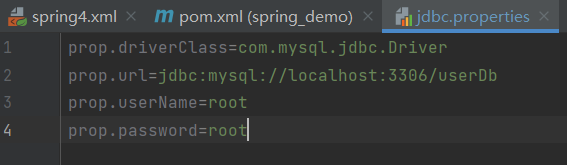
  3. 把外部properties属性引入到spring配置文件中
     (1) 引入context名称空间

        ```名称空间
            xmlns="http://www.springframework.org/schema/beans"
            xmlns:xsi="http://www.w3.org/2001/XMLSchema-instance"
            xmlns:context="http://www.springframework.org/schema/context"
            xsi:schemaLocation="http://www.springframework.org/schema/beans http://www.springframework.org/schema/beans/spring-beans.xsd
                                http://www.springframework.org/schema/util http://www.springframework.org/schema/beans/spring-util.xsd
                                http://www.springframework.org/schema/context http://www.springframework.org/schema/beans/spring-context.xsd">
        ```

      (2) 在spring配置文件中使用标签引入外部属性文件

     ```引入
            <context:property-placeholder location="classpath:jdbc.properties"></context:property-placeholder>
            <bean id="dataSource" class="com.alibaba.druid.pool.DruidDataSource">
                <property name="driverClassName" value="${prop.driverClass}"></property>
                <property name="url" value="${prop.url}"></property>
                <property name="username" value="${prop.userName}"></property>
                <property name="password" value="${prop.password}"></property>
            </bean>
     ```

+ IOC操作Bean管理(基于注解方式)
  1. 什么是注解
   (1) 注解是代码特殊标记，格式：@注解名称(属性名称=属性值，属性名称=属性值...)
   (2) 使用注解：注解作用在类上面，方法上面，属性上面
   (3) 使用注解目的：简化xml配置
  2. Spring针对Bean管理中创建对象提供注解
   (1)@Component
   (2)@Service
   (3)@Controller
   (4)@Respository
   上面四个注解功能是一样的，都可以用来创建bean实例
  3. 基于注解方式实现对象创建
     (1)引入依赖

        ```引入依赖
            <dependency>
                <groupId>org.aspectj</groupId>
                <artifactId>aspectjweaver</artifactId>
                <version>1.9.19</version>
            </dependency>
            <dependency>
                <groupId>org.springframework</groupId>
                <artifactId>spring-aop</artifactId>
                <version>6.0.3</version>
            </dependency>
            <dependency>
                <groupId>org.springframework</groupId>
                <artifactId>spring-aspects</artifactId>
                <version>6.0.3</version>
            </dependency>
        ```

     (2) 开启组件扫描

        ```开启
            xmlns="http://www.springframework.org/schema/beans"
            xmlns:xsi="http://www.w3.org/2001/XMLSchema-instance"
            xmlns:context="http://www.springframework.org/schema/context"
            xsi:schemaLocation="http://www.springframework.org/schema/beans http://www.springframework.org/schema/beans/spring-beans.xsd
                                http://www.springframework.org/schema/context
                                http://www.springframework.org/schema/context/spring-context.xsd">
                                ...................
                                ...................
            <!--    开启组件扫描
                1 如果扫描多个包，多个包使用逗号隔开
                1 扫描包上层目录-->
            <!--    示例1-->
            <!--    <context:component-scan base-package="com.example.service,com.example.dao"></context:component-scan>-->
            <!--    示例2-->
            <!--    <context:component-scan base-package="com.example"></context:component-scan>-->
            <!--    示例3-->
            <!--    <context:component-scan base-package="com.example" use-default-filters="false">-->
            <!--        <context:include-filter type="annotation" expression="org.springframework.stereotype.Controller"/>-->
            <!--    </context:component-scan>-->
            <!--    示例4-->
            <!--<context:component-scan base-package="com.example">-->
            <!--    <context:exclude-filter type="annotation" expression="org.springframework.stereotype.Controller"/>-->
            <!--</context:component-scan>-->
        ```

     (3) 创建类，在类上面添加创建对象的注解

        ```注解
            //在注解里面value属性值可以省略不写，默认值是类名称首字母小写
            @Component(value = "userService") // <bean id="userService" class="UserService"></bean>
            public class UserService {
                public void add(){
                    System.out.println("Service add...");
                }
            }
        ```

  4. 基于注解方式实现属性注入
    [链接-注解方式](https://blog.csdn.net/qq_44543508/article/details/103695784)
     (1) @AutoWired:根据属性类型进行自动装配
        第一步：把service和dao对象创建，在service和dao
        第二步：在service注入dao对象，在service类添加dao类型属性，在属性上面使用注解

        ```代码
            @Service
            public class UserService {
                //定义dao类型属性
                //添加注入属性注解
                @Autowired  //根据类型进行注入
                private UserDao userDao;
                //不需要添加set方法
                public void add(){
                    System.out.println("Service add...");
                    userDao.add();
                }
            }
            ...
            @Repository(value = "userDaolmpl")
            public class UserDaoImpl implements UserDao {
                @Override
                public void add() {
                    System.out.println("Dao add......");
                }
            }
            ...
            public interface UserDao {
                public void add();
            }
            ...
            public class TestDemo {
                @Test
                public void testService(){
                    ApplicationContext context = new ClassPathXmlApplicationContext("spring.xml");
                    UserService userService = context.getBean("userService", UserService.class);
                    userService.add();
                    System.out.println(userService);
                }
            }
        ```
     (2) @Qualifier:根据属性名称进行注入

        ```代码
            @Service
            public class UserService {
                //定义dao类型属性
                //添加注入属性注解
                @Autowired  //根据类型进行注入
                @Qualifier(value = "userDaolmpl")
                private UserDao userDao;
                //不需要添加set方法
                public void add(){
                    System.out.println("Service add...");
                    userDao.add();
                }
            }
            ...
            @Repository(value = "userDaolmpl")
            public class UserDaoImpl implements UserDao {
                @Override
                public void add() {
                    System.out.println("Dao add......");
                }
            }
        ```

     (3) @Resource:可以根据类型注入，也可以根据名称注入
     (4) @Value:注入普通类型属性

  5. 完全注解开发
     (1)创建配置类,替换xml配置文件

        ```代码
            @Configuration  //作为配置类，替换xml配置文件
            @ComponentScan(basePackages = {"com.example"})

            ···

            @Test
            public void test_1(){
                ApplicationContext context = new ClassPathXmlApplicationContext("spring.xml");
                UserService userService = context.getBean("userService", UserService.class);
                userService.test();
                System.out.println(userService);
            }
            //对比
            @Test
            public void test_2(){
                ApplicationContext context = new AnnotationConfigApplicationContext(SpringConfig.class);
                UserService userService = context.getBean("userService", UserService.class);
                userService.test();
                System.out.println(userService);
            }
            ```

## AOP原理

1. AOP底层原理
2. AOP操作

### AOP概念和原理

+ 什么是AOP
   (1) 面向切面编程(方面)，利用AOP可以对业务逻辑的各个部分进行隔离，从而使得业务逻辑各部分之间耦合度降低，提高程序的可用性，同时提高了开发的效率
   (2) 通俗描述：不通过修改源代码方式，在主干功能里面添加功能
   (3)例子说明
   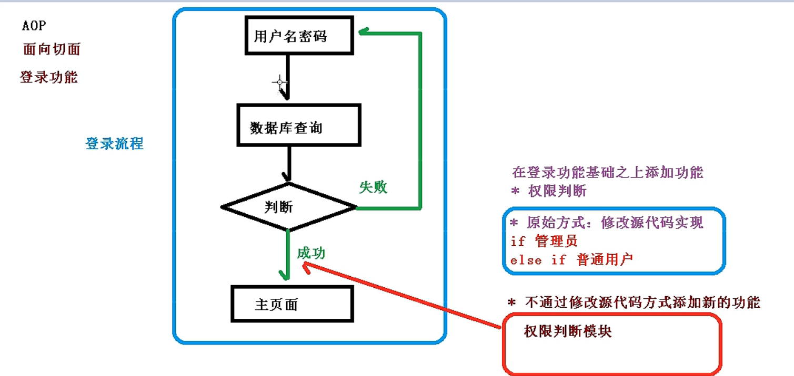

+ AOP(底层原理)
  
  1. AOP底层使用动态代理
    (1)有两种情况动态代理
    第一种 有接口情况，使用JDK动态代理
    创建接口实现类代理对象，增强类的方法
        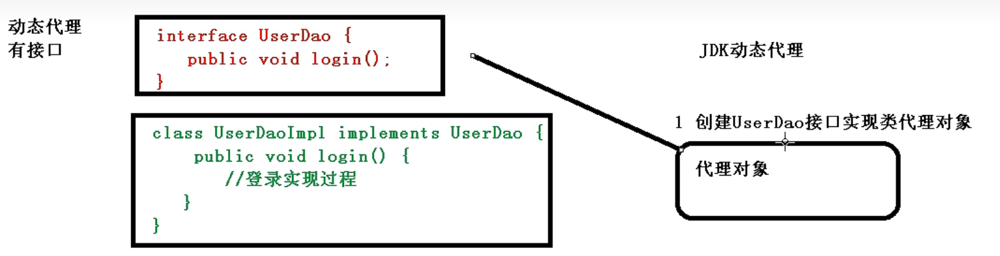
    第二种 没有接口，使用CGLIB动态代理
    创建子类的代理对象，增强类的方法
        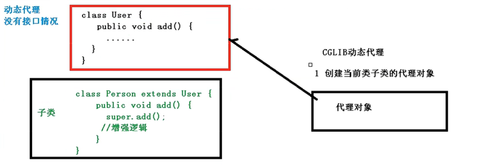

  2. AOP动态代理实例
       + 使用JDK动态代理，使用Proxy类里面的方法创建代理对象
          > static Object     newProxyInstance(ClassLoader loader,类<?>[] interfaces,InvocationHandler h)(返回指定接口的代理类的实例，该接口将方法调用分配给指定的调用处理程序)
     (1)调用newProxyInstance方法
        方法有三个参数：
        第一参数，类加载器
        第二参数，增强方法所在的类，这个类实现的接口，支持多个接口
        第三参数，实现这个接口InvocationHandler，创建代理对象，写增强的方法
       + 代码
        (1)创建接口，定义方法
        (2)创建接口实现类，实现方法
        (3)使用Proxy类创建接口代理对象

            ```代码
            public interface UserDao {
                public int add(int a,int b);

                public String update(String id);
            }
            ...
            public class UserDaoImpl implements UserDao {
                @Override
                public int add(int a, int b) {
                    return a+b;
                }
                @Override
                public String update(String id) {
                    return id;
                }
            }
            ...
            package com.example.service;

            import java.lang.reflect.InvocationHandler;
            import java.lang.reflect.Method;
            import java.lang.reflect.Proxy;
            import java.util.Arrays;

            public class JDKProxy {
                public static void main(String[] args) {
                    //创建接口实现类代理对象
                    Class[] interfaces = {UserDao.class};
            //        Proxy.newProxyInstance(JDKProxy.class.getClassLoader(), interfaces, new InvocationHandler() {
            //            @Override
            //            public Object invoke(Object proxy, Method method, Object[] args) throws Throwable {
            //                return null;
            //            }
            //        });
                    UserDaoImpl userDao = new UserDaoImpl();
                    UserDao dao = (UserDao)Proxy.newProxyInstance(JDKProxy.class.getClassLoader(), interfaces, new UserDaoProxy(userDao));
                    int result = dao.add(1,2);
                    System.out.println("result:"+result);
                }
            }

            //创建代理对象代码
            class UserDaoProxy implements InvocationHandler{
                //1 创建的是谁的代理对象，把谁传递过来
                //有参构造传递
                private Object obj;
                public  UserDaoProxy(Object obj) {
                    this.obj = obj;
                }

                //增强的逻辑
                @Override
                public Object invoke(Object proxy, Method method, Object[] args) throws Throwable {
                    //方法之前
                    System.out.println("方法之前执行"+method.getName()+":传递的参数..."+ Arrays.toString(args));

                    //被增强的方法执行
                    Object res = method.invoke(obj,args);

                    //方法之后
                    System.out.println("方法之后执行..."+obj);

                    return res;
                }
            }

            ```

+ AOP(术语)  
  1. 连接点
    类里面哪些方法可以被增强，这些方法称为连接点
  2. 切入点
    实际被真正增强的方法，称为切入点
  3. 通知(增强)
    (1)实际增强的逻辑部分称为通知(增强)
    (2)通知有多种类型
        前置通知
        后置通知
        环绕通知
        异常通知
        最终通知 finally
  4. 切面
    是动作
    (1)把通知应用到切入点过程

+ AOP操作(准备)
  1. Spring框架一般都是基于AspectJ实现AOP操作
    (1)什么是AspectJ
     Aspectj不是Spring组成部分，独立AOP框架，一般和Spring一起使用，进行AOP操作
  2. 基于AspectJ实现AOP操作
    (1)基于xml配置文件实现
    (2)基于注解方式实现(使用)
  3. 在项目工程里面引入AOP相关依赖
  4. 切入点表达式
    (1)切入点表达式作用：知道对哪个类里面的哪个方法进行增强
    (2)语法结构:
     > esecution([权限修饰符][返回类型][类全路径][方法名称][参数列表])

