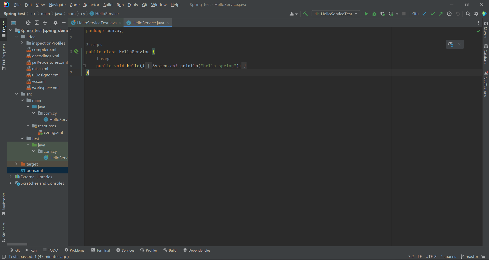
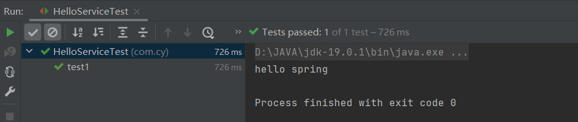
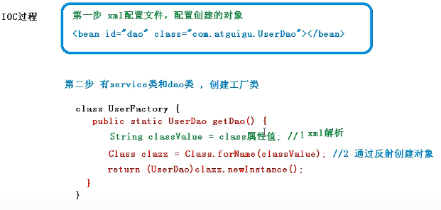
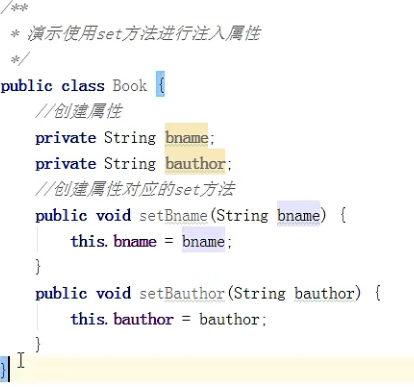

# Spring学习笔记

[链接-MarkDown语法](https://simimi.cn/note/markdown-basic-syntax/#%E4%B8%80%E3%80%81%E5%9F%BA%E6%9C%AC%E7%AC%A6%E5%8F%B7%EF%BC%9A-gt)

## Spring框架概述

1. Spring是轻量级的开源的JavaEE框架
2. Spring可以解决企业应用开发的复杂性
3. Spring有两个核心部分：IOC和AOP
   (1) IOC:控制反转：把创建对象的过程交给Spring进行管理
   (2) AOP:面向切片，不修改源代码进行功能增强
4. Spring特点
   (1) 方便解耦，简化开发
   (2) AOP编程支持
   (3) 方便程序测试
   (4) 方便和其他框架进行整合
   (5) 方便进行事务操作
   (6) 降低API开发难度
5. 课程以Spring5.x为例

## 创建一个spring案例

1. 修改pom.xml文件
   
2. 编写main包里的代码
   
3. 在resource包里编写spring配置文件
   
4. 在test包里编写测试代码
   
5. 运行测试代码
   

### 注意

+ MAVEN搭建Spring环境
  + 案例
   [链接](https://blog.csdn.net/qq_31993621/article/details/82470305)  
+ ERROR:JAVA: 错误: 不支持发行版本 5  
  + 解决方法
   [链接](https://eli-coin.blog.csdn.net/article/details/119142118?spm=1001.2014.3001.5506)

## IOC容器

1. IOC底层原理
2. IOC接口(BeanFactory)
3. IOC操作Bean管理(基于xml)
4. IOC操作Bean管理(基于注解)

### IOC概念和原理

1. 什么是IOC
   (1)控制反转，把对象创建和对象之间的调用过程，交给Spring进行管理
   (2)使用IOC目的：为了耦合度降低
   (3)做入门案例就是为了IOC实现

2. IOC底层原理
   (1)xml解析，工厂模式，反射
3. 画图讲解IOC底层原理
   目的：将耦合度降低到能够满足设计需求的最低限度
   
   

4. IOC接口
   1. IOC思想基于IOC容器完成，IOC容器底层就是对象工厂
   2. Spring提供IOC容器实现两种方式：（两个接口）
   (1)BeanFactory:IOC容器的基本实现，是Spring内部的使用接口，不提供开发人员进行使用。加载配置文件时候不会创建对象，在获取对象(使用)时才会创建对象(懒加载)
   (2)ApplicationContext：BeanFactory接口的子接口，提供了更多更强大的功能，一般面向开发人员使用。加载配置文件时候就会把在配置文件中的对象创建(预加载)
   3. ApplicationContext接口有实现类
   
5. IOC操作Bean管理
   1. 什么是Bean管理
   (1)Spring创建对象
   (2)Spring注入属性
   2. Bean管理操作有两种方式
   (1)基于xml配置文件方式实现
   (2)基于注解方式实现
6. IOC操作Bean管理(基于xml方式)
   1. 基于xml方式创建对象
   
   2. 基于xml方式注入属性
   3. p名称空间注入
   
   第一种：
   (1)创建类，定义属性和对应的set方法
   
   (2)在spring配置文件配置对象创建
   效果类似于下图
   
   
   
   第二种：使用有参数构造进行注入
   (1)创建类，定义属性，创建属性对应有参数构造方法
   
   
   第三种：基于p名称空间注入，可以简化基于xml配置方式
   （1）添加p名称空间在配置文件中
   
   (2)进行属性注入，在bean标签里面操作
   

7.IOC操作Bean管理(xml注入其他类型属性)

   1. 字面量
   (1)null值
      
   (2)属性值中包含特殊符号，比如<>
      第一种：把<>进行转义
      第二种：把带特殊符号内容写到CDATA
      

