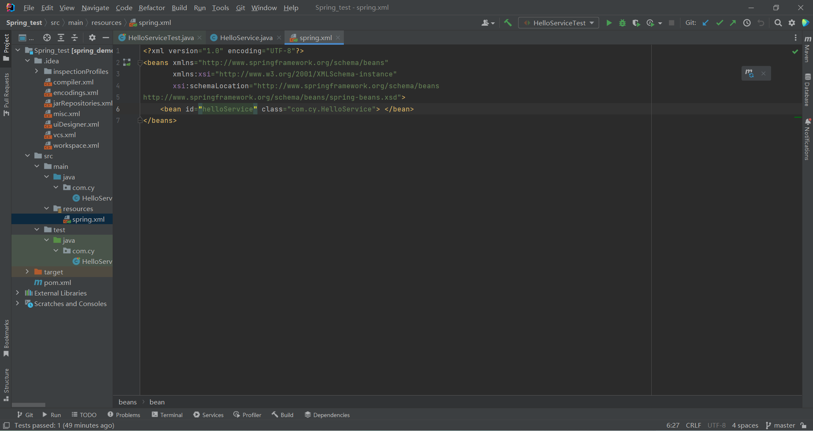
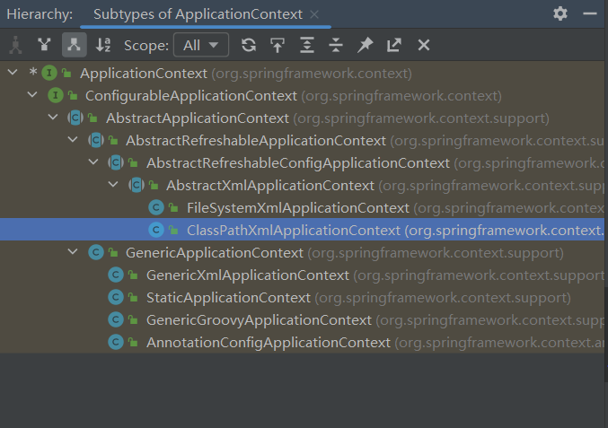
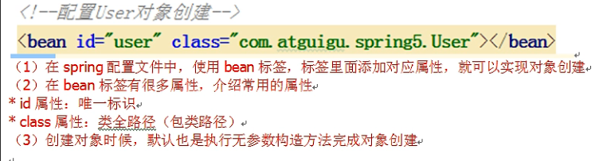
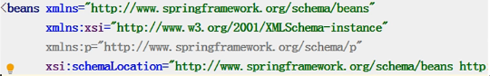
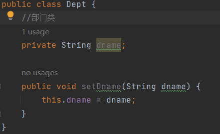
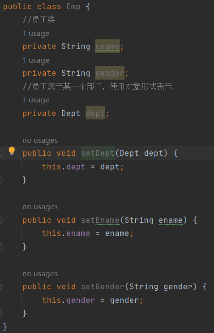

# Spring学习笔记

[链接-MarkDown语法](https://simimi.cn/note/markdown-basic-syntax/#%E4%B8%80%E3%80%81%E5%9F%BA%E6%9C%AC%E7%AC%A6%E5%8F%B7%EF%BC%9A-gt)

## Spring框架概述

1. Spring是轻量级的开源的JavaEE框架
2. Spring可以解决企业应用开发的复杂性
3. Spring有两个核心部分：IOC和AOP
   (1) IOC:控制反转：把创建对象的过程交给Spring进行管理
   (2) AOP:面向切片，不修改源代码进行功能增强
4. Spring特点
   (1) 方便解耦，简化开发
   (2) AOP编程支持
   (3) 方便程序测试
   (4) 方便和其他框架进行整合
   (5) 方便进行事务操作
   (6) 降低API开发难度
5. 课程以Spring5.x为例

## 创建一个spring案例

1. 修改pom.xml文件
   
2. 编写main包里的代码
   
3. 在resource包里编写spring配置文件
   
4. 在test包里编写测试代码
   
5. 运行测试代码
   

### 注意

+ MAVEN搭建Spring环境
  + 案例
   [链接](https://blog.csdn.net/qq_31993621/article/details/82470305)  
+ ERROR:JAVA: 错误: 不支持发行版本 5  
  + 解决方法
   [链接](https://eli-coin.blog.csdn.net/article/details/119142118?spm=1001.2014.3001.5506)

## IOC容器

1. IOC底层原理
2. IOC接口(BeanFactory)
3. IOC操作Bean管理(基于xml)
4. IOC操作Bean管理(基于注解)

### IOC概念和原理

+ 什么是IOC
   (1)控制反转，把对象创建和对象之间的调用过程，交给Spring进行管理
   (2)使用IOC目的：为了耦合度降低
   (3)做入门案例就是为了IOC实现

+ IOC底层原理
   (1)xml解析，工厂模式，反射

+ 画图讲解IOC底层原理
   目的：将耦合度降低到能够满足设计需求的最低限度
   
   

+ IOC接口
   1. IOC思想基于IOC容器完成，IOC容器底层就是对象工厂
   2. Spring提供IOC容器实现两种方式：（两个接口）
   (1)BeanFactory:IOC容器的基本实现，是Spring内部的使用接口，不提供开发人员进行使用。加载配置文件时候不会创建对象，在获取对象(使用)时才会创建对象(懒加载)
   (2)ApplicationContext：BeanFactory接口的子接口，提供了更多更强大的功能，一般面向开发人员使用。加载配置文件时候就会把在配置文件中的对象创建(预加载)
   3. ApplicationContext接口有实现类
   

+ IOC操作Bean管理
   1. 什么是Bean管理
   (1)Spring创建对象
   (2)Spring注入属性
   2. Bean管理操作有两种方式
   (1)基于xml配置文件方式实现
   (2)基于注解方式实现

+ IOC操作Bean管理(基于xml方式)
   1. 基于xml方式创建对象
   
   2. 基于xml方式注入属性
   3. p名称空间注入
   
   第一种：
   (1)创建类，定义属性和对应的set方法
   
   (2)在spring配置文件配置对象创建
   效果类似于下图
   
   
   
   第二种：使用有参数构造进行注入
   (1)创建类，定义属性，创建属性对应有参数构造方法
   
   
   第三种：基于p名称空间注入，可以简化基于xml配置方式
   （1）添加p名称空间在配置文件中
   
   (2)进行属性注入，在bean标签里面操作
   

+ IOC操作Bean管理(xml注入其他类型属性)

   1. 字面量
   (1)null值
      
   (2)属性值中包含特殊符号，比如<>
      第一种：把<>进行转义
      第二种：把带特殊符号内容写到CDATA
      
   2. 注入属性-外部bean
      (1)创建两个类service类和dao类
      (2)在service调用dao里面的方法
      (3)在spring配置文件中进行配置
      
   3. 注入属性-内部bean
      (1)一对多关系：部门和员工
      一个部门有多个员工，一个员工属于一个部门
      部门是一，员工是多
      (2)在实体类之间表示一对多关系,员工的所属部门，使用对象类型属性进行表示
      
      
      (3)在spring配置文件中进行配置
      
      注意：如果输出bean@地址，需要重写toString方法
   4. 注入属性-级联赋值
      在spring配置文件中进行配置

```123
<!--     级联赋值-->
   <bean id="emp" class="bean.Emp">
<!--        设置两个普通属性-->
        <property name="ename" value="David"></property>
        <property name="gender" value="男"></property>
<!--    级联赋值-->
        <property name="dept" ref="dept"></property>
<!--        <property name="dept.dname" value="技术部"></property>-->
    </bean>
    <bean id="dept" class="bean.Dept">
        <property name="dname" value="财务部"></property>
    </bean>
```

   作为对比，这是外部bean  

```123
<!--    1.service和dao对象创建-->
    <bean id="userService" class="service.UserService">
<!--        注入userDao对象
            name属性值：类里面属性名称
            ref属性：创建userDao对象bean标签id值
-->
        <property name="userDao" ref="userDao"></property>
    </bean>
    <bean id="userDao" class="dao.UserDaoImpl"></bean>
```

+ IOC操作Bean管理(xml注入集合属性)

   1. 注入数组类型属性
   2. 注入List集合类型属性
   3. 注入Map集合类型属性
      (1) 创建类，定义数组，list，map，set类型，生成对应set方法
      
      (2) 在spring配置文件中进行配置
   4. 在集合类型里面设置对象类型值
   5. 把集合注入部分提取出来

```123
public class Stu {
    //1 数组类型属性
    private String[] course;
    //2 list集合类型属性
    private List<String> list;
    //3 map集合类型属性
    private Map<String,String>maps;
    //4 set集合类型属性
    private Set<String>sets;

    //学生所学多门课程
    private List<Course>courseList;

    public void setCourseList(List<Course> courseList) {
        this.courseList = courseList;
    }

    public void setCourse(String[] course) {
        this.course = course;
    }

    public void setList(List<String> list) {
        this.list = list;
    }

    public void setMaps(Map<String, String> maps) {
        this.maps = maps;
    }

    public void setSets(Set<String> sets) {
        this.sets = sets;
    }

    public void test(){
        System.out.println(Arrays.toString(course));
        System.out.println(list);
        System.out.println(maps);
        System.out.println(sets);
        System.out.println(courseList);
    }
}
```

```123
<bean id="stu" class="com.example.Stu">
    <!--数组类型属性注入-->
            <property name="course">
                <array>
                    <value>Java课程</value>
                    <value>数据库课程</value>
                </array>
            </property>
    <!--list类型注入-->
            <property name="list">
                <list>
                    <value>张三</value>
                    <value>张饼子</value>
                </list>
            </property>
    <!--map类型注入-->
            <property name="maps">
                <map>
                    <entry key="JAVA" value="java"></entry>
                    <entry key="PHP" value="php"></entry>
                </map>
            </property>
    <!--set类型注入-->
        <property name="sets">
            <set>
                <value>MySQL</value>
                <value>Redis</value>
            </set>
        </property>
   ```

```4
public class Course {
    private String cname;  //课程名称

    public void setCname(String cname) {
        this.cname = cname;
    }

    @Override
    public String toString() {
        return "Course{cname="+cname+"}";
    }
}
```

```4
<!--注入list集合类型，值是对象-->
        <property name="courseList">
            <list>
                <ref bean="course1"></ref>
                <ref bean="course2"></ref>
            </list>
        </property>
    </bean>
    <bean id="course1" class="com.example.Course">
        <property name="cname" value="Spring框架"></property>
    </bean>
    <bean id="course2" class="com.example.Course">
        <property name="cname" value="MyBatis框架"></property>
    </bean>
```

```5
<!--1 提取list集合类型属性注入-->
    <util:list id="booklist">
        <value>猫和老鼠</value>
        <value>翡冷翠的一夜</value>
        <value>哈利波特</value>
    </util:list>

    <!--2 提取list集合类型属性注入使用-->
    <bean id="book" class="com.example.Book">
        <property name="list" ref="booklist"></property>
    </bean>
```

+ IOC操作Bean管理(FactoryBean)
   1. Spring有两2.种类型bean，一种是普通bean，另外一种工厂bean(FactoryBean)
   2. 普通bean:在配置文件中定义bean类型就是返回类型
   3. 工厂bean：在配置文件定义bean类型可以和返回类型不一样(可以修改默认返回的bean类型)
   第一步 创建类，让这个类作为工厂bean，实现接口FactoryBean
   第二步 实现接口里面的方法，在实现的方法中定义返回的bean类型
   
   
   

+ IOC操作Bean管理(bean作用域)
  1. 在Spring里边，设置创建bean实例是单实例还是多实例
  2. 在Spring里面，默认情况下，bean是单实例对象
   如图，地址相同
   
  3. 如何设置单实例还是多实例
   (1)在spring配置文件bean标签里面有属性用于设置单实例还是多实例
   (2)scope属性值
   第一个值：默认值，singleton，表示单实例对象
   第二个值：prototype，表示多实例对象
   
   
   (3)singleton和prototype区别
   第一：singleton单实例，prototype多实例
   第二：设置scope值是singleton时，加载spring配置文件就会创建单实例对象；设置scope值是prototype时候，不是在加载spring配置文件时候创建对象，在调用getBean方法时创建多实例对象。

+ IOC操作Bean管理(bean生命周期)
  1. 生命周期
   [链接-参考视频](https://simimi.cn/note/markdown-basic-syntax/#%E4%B8%80%E3%80%81%E5%9F%BA%E6%9C%AC%E7%AC%A6%E5%8F%B7%EF%BC%9A-gt)
   (1)从对象创建到对象销毁的过程
  2. bean生命周期
   (1)通过构造器创建bean实例(无参数构造)
   (2)为bean属性设置值和对其他bean的引用(调用set方法)
   (3)调用bean的初始化的方法(需要进行配置)
   (4)bean可以使用了(获取创建bean实例对象)
   (5)当容器关闭时候，调用bean的销毁方法(需要进行配置销毁的方法)
  3. bean的后置处理器，bean的生命周期完整为七步
   (1)通过构造器创建bean实例(无参数构造)
   (2)为bean属性设置值和对其他bean的引用(调用set方法)
   (3)把bean实例传递bean后置处理器的方法
   (4)调用bean的初始化的方法(需要进行配置)
   (5)把bean实例传递bean后置处理器的方法
   (6)bean可以使用了(获取创建bean实例对象)
   (7)当容器关闭时候，调用bean的销毁方法(需要进行配置销毁的方法)